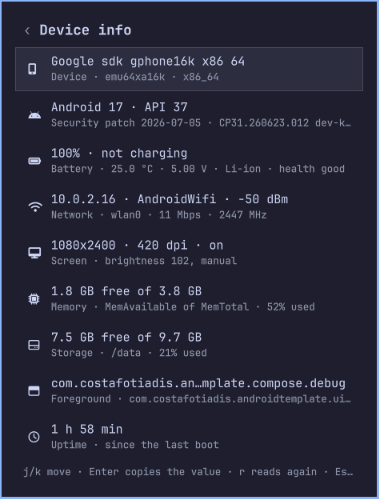
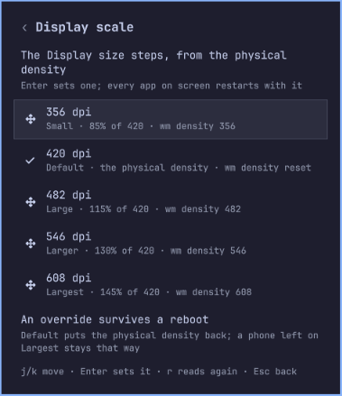
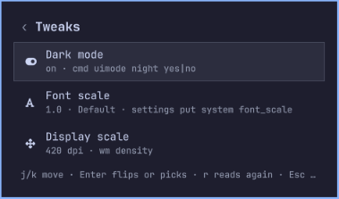
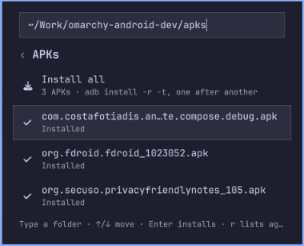
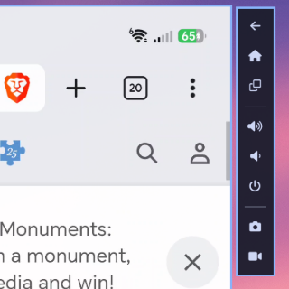
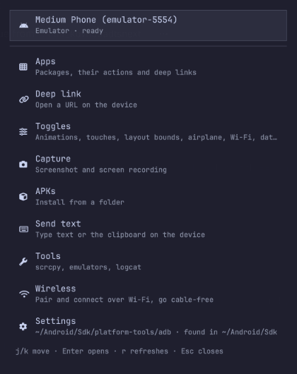

# Android Dev for Omarchy


A companion plugin for the typical stuff an Android developer does on the day-to-day. Although mainly targetted for devs, you might find it does a lot of cool stuff you might like as an android power user.

This first started as a port of another app I made for Windows -- [ADB Extension for Command Palette](https://github.com/CostaFot/AdbExtension) but then it escalated.

```bash
omarchy plugin add https://github.com/CostaFot/omarchy-android-dev --enable
```

Setting it up from a coding agent? See [From a coding agent](#from-a-coding-agent) at the end.

The rest of the readme is mainly targetted at humans who like pretty pictures.

## In the bar


* Lights up when connected to a device, dimmed without one
*  red while the selected device waits for authorisation or is offline
* red with a dot while a screen recording runs

With more than one device the count sits next to it.

* Left click opens the panel, right click the window (with *Open as a window* on, the other way round)
* Middle click reads adb and the devices again

There's also out of the box notification support when devices connects/disconnect/need authorising etc.

## The panel

<p>


</p>

Opens on a hub: the selected device with its state, then the pages. The last row, *Open as a window*, moves the whole thing into a window.

Keys are the usual:

* `j`/`k` or the arrows move, Enter runs
* `r` reads the page again
* Escape or Backspace goes back a page, Escape on the hub closes
* pages with a box (a filter, a URL, a folder, some text) take typing straight away, `/` puts the caret back in the box

### Devices

Every device adb can see, with its kind (USB, emulator, Wi-Fi) and state. Enter picks the one the other pages talk to. With one device there's nothing to pick.

### Device info



The device at a glance:

* model and the name it goes by
* Android version, API level, security patch, build
* battery, how it's charging and how warm it is
* IP address, Wi-Fi network and signal
* screen size, density, state and brightness
* memory and storage free
* the activity in the foreground
* uptime

Enter on a row copies its value. The IP for an `adb connect` from a terminal, the build for a bug report, that kind of thing.

### Apps

<p>


</p>

The packages on the device, third-party by default (*Show system apps* lists the lot), with a filter box. Foreground first, then running, then debuggable, then the rest. The one you last opened sits on top.

Enter on a package gives you the actions:

* Launch, Restart, Kill process
* Clear app data, Clear data and restart, Force stop
* Open deep link
* Uninstall (asks first)
* Grant all permissions, Revoke all permissions

Each row names the adb command it runs.

A package with more than one launcher activity (a debug build with LeakCanary, say) asks which one the first time you press Launch and remembers it. The *Launcher activity* row under Launch changes the pick.

### Deep link

The bane of all existence.


Type a URL or a custom scheme, Enter fires it (`am start -a android.intent.action.VIEW -d URL`). The last ten sit under *Recent*.

From a package's actions page the link is scoped to that package, so an ambiguous scheme lands in the right app.

### Toggles


The developer toggles with their current state read from the device. Enter flips one.

* Animations
* Show touches
* Pointer location
* Layout bounds
* Airplane mode
* Wi-Fi
* Mobile data
* Bluetooth
* Demo mode

Demo mode is Android's clean status bar for screenshots/demos: clock at 12:00, full battery, full signal, no notification icons. My HONOR phone took the battery and the notification icons but kept its real clock and signal bars. Yours might be different, you never know with these OEMs.

### Tweaks

<p>


</p>

The most common display settings one keeps flipping while checking a UI: Dark mode, Font scale and Display scale.

* Enter on Dark mode flips it (`cmd uimode night`)
* Enter on a scale opens a picker with Android's own steps, Small to Largest, a check on the current one
* the Default stop of the display picker is `wm density reset`

A density override survives a reboot and leaves a phone looking odd until it's put back, so the page says so under the row while one is set.

Over IPC, `dark toggle`, `fontscale next` and `density next` step through them from a keybinding.

### Capture

<p>


</p>

* Screenshot: saved to your Pictures folder, put on the clipboard, shown in a notification
* Start recording: `screenrecord` on the device (three minutes max) while the row counts the seconds and the bar glyph shows a dot. Enter again stops it and the mp4 lands in your Videos folder

The folders follow Omarchy's own (`OMARCHY_SCREENSHOT_DIR`, `OMARCHY_SCREENRECORD_DIR`, else `~/Pictures` and `~/Videos`) and can be changed in the settings.

### APKs

<p>


</p>

Prefilled from the *APK folder* setting (`~/Downloads`)/

* Enter on one installs it (`adb install -r -t`, so a testOnly debug build installs too) and the row says Installed or quotes adb's `Failure [...]`
* *Install all* runs them one after another with one notification for the batch
* the folders you've installed from are listed under the files, newest first. Enter puts one back in the box

### Send text


Types a line into whatever field has focus on the device, or sends the clipboard.

Android's `input text` does one line of ASCII, so anything else is refused rather than typed wrong. A `%s` in the text becomes a space on the device, that's input's own escape.

### Tools


* *Mirror with scrcpy*, once scrcpy is installed. With *Mirror with the screen off* on, the phone's screen goes dark and stays awake while the mirror runs. The *Extra scrcpy arguments* setting is appended
* *Logcat* for the package you last opened, in your default terminal (`adb logcat --pid=…`, so the app has to be running)
* one row per emulator AVD, Running or Stopped. Enter on a stopped one asks for a *Quick boot* or a *Cold boot* (`-no-snapshot-load`, for when a snapshot misbehaves). Enter on a running one stops it, after a confirm

### Extra controls for mirrored devices



While a scrcpy window is up, a strip of the phone's keys sits along its right edge and follows it around: Back, Home, Recents, Volume up, Volume down, Power, then Screenshot and Record.

scrcpy has these as Mod shortcuts and shows nothing on screen. The strip is a click each and never takes keyboard focus, so typing into the mirror keeps working.

The *Keys beside the mirror* setting turns it off if you don't like it.

### Wireless

<p>


</p>

Gets a phone onto Wi-Fi debugging. I always found Wi-Fi debugging finnicky in general so I tried to sort out a lot of the roadblocks I encountered throughout the years with VPN shenanigans and all that.

* *Pair with a QR code* shows a code in the panel. On the phone: Developer options › Wireless debugging › *Pair device with QR code*, and scan it from there, **nowhere else**. The code is a Wi-Fi-credential string by format and a camera app would try to join a network that doesn't exist. The plugin waits up to two minutes and pairs
* *Pair with a code* is for the phone's *Pair device with pairing code* dialog. While that dialog is open the phone announces its pairing address and the page lists it, so Enter takes the address and you only type the six digits. The address can be typed too, for an adb without mDNS

After that adb connects on its own whenever the phone's Wireless debugging is on. Android picks a new port every time it's toggled and adb finds it through mDNS, so nothing to type again.

A paired phone that's on the network but not connected shows under *Seen on the network*. A phone over Wi-Fi mirrors, records and does every other page like a plugged one.

The old cable-first way, `adb tcpip 5555`, isn't on the page since I don't think it's that useful tbh. The helper keeps `tcpip` and `usb` for the terminal.

When a VPN interface is up on this machine the page says so at the bottom of the page: a VPN that isolates the LAN is the usual reason nothing on Wi-Fi ever answers. A connect or a pairing that times out names it too.

### Settings


The adb binary, the screenshot, recording and APK folders, the extra scrcpy arguments, and seven switches. 

Save writes what changed to your `shell.json` and the plugin takes it at once so not restart needed.

Every action shows its result in the panel and sends a notification with the device's name.

## Optional window mode



The same plugin pages can be shows as a persistent window, for when the panel should stay put: next to the mirror, on its own workspace. I prefer it that way myself but thought people are too used to plugin floating panels by now.

* `omarchy-shell costafot.android-dev window toggle` opens and closes it. `open`, `close` or a page name (`window toggles`) work too
* it's a Wayland toplevel titled `Android Dev`, class `org.quickshell`, so Hyprland tiles or floats it like any app
* same keys as the popup. Escape on the hub or the close button closes it
* the popup and the window can be open at once and show the same device

Prefer the window as the one-key surface? Turn *Open as a window* on. The glyph's left click and the `open`, `toggle` and `page` verbs then open the window, and right click opens the popup.

## Settings

Saved on the plugin's entry in `~/.config/omarchy/shell.json`, from the panel's Settings page or with `omarchy bar set costafot.android-dev KEY VALUE` (`--json` for a boolean, the plain word works too). Picked up at once either way.

| Key | Default | What it does |
|---|---|---|
| `adbPath` | empty | The adb binary, or the folder holding it. Empty looks in `$ANDROID_HOME` or `$ANDROID_SDK_ROOT`, then `~/Android/Sdk/platform-tools`, then `PATH`. A path that holds no adb is reported on the hub, not silently replaced. |
| `screenshotDir` | empty | Where screenshots go. Empty uses `OMARCHY_SCREENSHOT_DIR`, else your Pictures folder. |
| `recordingDir` | empty | Where screen recordings go. Empty uses `OMARCHY_SCREENRECORD_DIR`, else your Videos folder. |
| `apkDir` | `~/Downloads` | Where the APKs page starts looking. |
| `scrcpyArgs` | empty | Appended to the scrcpy command line, split on whitespace (`--always-on-top --keyboard=uhid`). |
| `mirrorScreenOff` | `false` | Mirror with the device's screen off: scrcpy gets `--turn-screen-off --stay-awake`, so the phone stays dark and, plugged in, awake while the mirror runs; the screen comes back when scrcpy closes. |
| `mirrorKeys` | `true` | The strip of keys beside the scrcpy window (Back, Home, Recents, the volume, Power, Screenshot, Record), following it around. |
| `notify` | `true` | Desktop notifications for actions and captures. |
| `deviceNotifications` | `true` | A notification when a device connects, disconnects or needs authorising. |
| `confirmUninstall` | `true` | Ask before uninstalling an app. |
| `showSystemApps` | `false` | List every package on the Apps page, not only third-party ones. |
| `openAsWindow` | `false` | The glyph's left click and the `open`, `toggle` and `page` verbs open the window instead of the popup; right click on the glyph opens the popup then. |

## Requirements

* `adb`, from the `android-tools` package or the SDK platform-tools. It doesn't need to be on `PATH`: the plugin looks in `$ANDROID_HOME`, `$ANDROID_SDK_ROOT` and `~/Android/Sdk` too, and the `adbPath` setting can point at it
* a device over USB with USB debugging on, or an emulator, or a phone over Wi-Fi (Android 11 or newer with Wireless debugging on)
* for the QR way and the pairing address showing up by itself, the SDK's adb (it has mDNS built in, the `android-tools` one doesn't) and `qrencode`, which Omarchy ships
* the phone and this machine on the same network with nothing in between. A VPN that isolates the LAN (NordVPN with LAN Discovery off, say) leaves you with timeouts
* optional: the SDK's `emulator` for the AVD rows and the `scrcpy` package for mirroring. The rows appear once they're installed

## From the shell

```bash
omarchy-shell costafot.android-dev help          # the verbs
omarchy-shell costafot.android-dev toggle        # the hub (the window instead, with openAsWindow on)
omarchy-shell costafot.android-dev status | jq   # adb, devices, the tracker, the settings in force
omarchy-shell costafot.android-dev screenshot    # saved, on the clipboard, with a notification
omarchy-shell costafot.android-dev select emulator-5554
omarchy-shell costafot.android-dev page packages # open the panel on a page: hub, devices, info, packages, deeplink, toggles, tweaks, capture, apks, text, tools, wireless, settings
omarchy-shell costafot.android-dev window toggle # the same pages as their own window; open, close, or a page name (window toggles) work too
omarchy-shell costafot.android-dev launch com.android.chrome   # forcestop and clear take a package too
omarchy-shell costafot.android-dev deeplink https://example.com
omarchy-shell costafot.android-dev flip touches  # animations, touches, pointer, layout, airplane, wifi, data, bluetooth, demo
omarchy-shell costafot.android-dev dark toggle   # or on, off; fontscale 1.15|next and density 482|reset|next are the other two tweaks
omarchy-shell costafot.android-dev record start  # stop pulls the mp4 into ~/Videos; toggle does either
omarchy-shell costafot.android-dev text "hello world"          # typed into the focused field; clipboard sends the clipboard
omarchy-shell costafot.android-dev scrcpy                      # mirror the selected device; the keys strip appears beside the window
omarchy-shell costafot.android-dev key back                    # press a key on it: back home recents power volup voldown wake sleep
omarchy-shell costafot.android-dev avd Medium_Phone            # start that emulator; avdcold NAME boots it fresh (-no-snapshot-load)
omarchy-shell costafot.android-dev logcat com.android.chrome   # adb logcat --pid in a terminal; no package follows everything
omarchy-shell costafot.android-dev pair start                  # a pairing QR code in the panel; stop cancels it
omarchy-shell costafot.android-dev disconnect ADDR             # drops a Wi-Fi entry (its ip:port, or the name adb gave a paired phone)
```

Every verb returns at once. The result arrives as a notification and in the panel.

## Keybindings, the menu and window rules

Omarchy's bindings live in `~/.config/hypr/bindings.lua`. Three lines give the panel, the window and a screenshot a key (`SUPER + ALT + A`, `SUPER + ALT + W` and `SUPER + ALT + C` are free in the defaults):

```lua
o.bind("SUPER + ALT + A", "Android Dev panel", "omarchy-shell costafot.android-dev toggle")
o.bind("SUPER + ALT + W", "Android Dev window", "omarchy-shell costafot.android-dev window toggle")
o.bind("SUPER + ALT + C", "Android screenshot", "omarchy-shell costafot.android-dev screenshot")
```

The same three as classic Hyprland config lines, for a `bindings.conf`:

```
bindd = SUPER ALT, A, Android Dev panel, exec, omarchy-shell costafot.android-dev toggle
bindd = SUPER ALT, W, Android Dev window, exec, omarchy-shell costafot.android-dev window toggle
bindd = SUPER ALT, C, Android screenshot, exec, omarchy-shell costafot.android-dev screenshot
```

For a row on the Omarchy menu (`SUPER + SPACE`), add to `~/.config/omarchy/extensions/omarchy-menu.jsonc`. The second line puts a screenshot row under the Capture submenu:

```jsonc
"android": {"icon":"","label":"Android Dev","action":"omarchy-shell costafot.android-dev toggle","description":"Devices, apps, toggles, tweaks, captures, APKs, emulators"},
"trigger.capture.android": {"icon":"","label":"Android screenshot","action":"omarchy-shell costafot.android-dev screenshot"},
```

The emulator and scrcpy open as tiled windows, which is rarely what a phone-shaped window wants. Tiled, the emulator keeps the phone's proportions, pads the rest of the tile grey and lets its toolbar float loose over it. Two rules in `~/.config/hypr/hyprland.lua` (after the `require` lines) float them:

```lua
o.window("^(Emulator)$", { float = true })
o.window({ class = "^(scrcpy)$", title = "^(Android Dev)$" }, { float = true, center = true })
```

Floated, the emulator takes its phone shape with the toolbar attached to its right edge, and reopens where you last dragged it (it remembers its own position, so `center` does nothing for it). scrcpy opens centred.

The plugin's own window tiles by default. A third rule floats it phone-sized, so it can sit beside the mirror:

```lua
o.window({ class = "^(org.quickshell)$", title = "^(Android Dev)$" }, { float = true, size = { 420, 760 } })
```

## From a terminal

Every command answers with one line of JSON. Errors ride inside it and the exit code is always 0.

```bash
bin/omarchy-android-dev status | jq '{adb, selected, tools}'
bin/omarchy-android-dev devices | jq '.devices[] | [.serial, .state, .label]'
bin/omarchy-android-dev info | jq '.info | map_values(.text)'         # the device at a glance: model, Android, battery, network, screen, memory, storage, foreground, uptime
bin/omarchy-android-dev packages | jq '.packages[] | [.name, .section, .detail]'
bin/omarchy-android-dev package com.android.chrome | jq '{launcher_activity, launcher_activities, runtime_permissions}'   # app launch PKG ACTIVITY starts one of them and remembers it
bin/omarchy-android-dev app launch com.android.chrome | jq .notice       # restart, force-stop, kill, clear, clear-restart, uninstall
bin/omarchy-android-dev perms grant com.android.chrome | jq .notice      # or revoke
bin/omarchy-android-dev deeplink https://example.com | jq .notice
bin/omarchy-android-dev toggles | jq '.toggles | map_values(.text)'
bin/omarchy-android-dev toggle touches | jq .notice                     # animations, touches, pointer, layout, airplane, wifi, data, bluetooth, demo
bin/omarchy-android-dev tweaks | jq '.tweaks | map_values(.text)'        # dark mode, the font scale, the display density
bin/omarchy-android-dev tweak dark | jq .notice                          # tweak font 1.15|next, tweak density 482|reset|next
bin/omarchy-android-dev screenshot | jq .path                           # saved, on the clipboard, with a notification
bin/omarchy-android-dev record                                          # records until Ctrl-C, then prints the mp4's path
bin/omarchy-android-dev select emulator-5554 | jq .notice               # with more than one device attached; --serial S does it per call
bin/omarchy-android-dev apk list ~/Downloads | jq '.apks[].name'        # apk install PATH... installs them in turn
bin/omarchy-android-dev text send "hello world" | jq .notice            # text clipboard sends the clipboard
bin/omarchy-android-dev key back | jq .notice                            # input keyevent by name: back home recents power volup voldown wake sleep
bin/omarchy-android-dev tools | jq '.avds[] | [.name, .detail]'         # tool scrcpy, tool avd NAME [cold], tool avd-stop SERIAL, tool logcat [PKG]
bin/omarchy-android-dev wireless | jq '{mdns, services}'                # the pairing and connect services on the network
bin/omarchy-android-dev pair qr                                         # prints the PNG's path, waits for the phone to scan it; Ctrl-C cancels
printf '123456\n' | bin/omarchy-android-dev pair code 192.168.1.5:37123 # the code on stdin, never on the command line
bin/omarchy-android-dev connect 192.168.1.5 | jq .notice                # disconnect ADDR; tcpip [USBSERIAL] and usb [SERIAL] are the older cable-first way, terminal only
```

Emulators show up by their AVD name, as in `Pixel 10 Pro Fold (emulator-5554)`.

## The legal bit

* the shell never runs `adb` itself. A Python 3 helper with no dependencies does, with an argument list, a deadline and a size cap on every call, and never through a shell string
* one device tracker (`adb track-devices`) runs per shell and comes back on its own when adb goes away
* the plugin never kills a process it didn't start. scrcpy, the emulator and the logcat terminal are launched detached, the way Omarchy's own launchers do it, and left alone. An emulator stops through `adb emu kill`
* scrcpy is told to use the same `adb` as the plugin, so a second adb on `PATH` (the `scrcpy` package installs one) changes nothing
* state lives in `~/.local/state/omarchy/costafot.android-dev/`: the selected device, the last package per device, the recent deep links, the folders you've installed APKs from, a package cache, and the pairing PNG while a code is up (readable by you alone, removed when the session ends). The folder is private to your user and checked on every run
* settings live on the plugin's entry in your `shell.json` and nowhere else
* a pairing code goes to `adb pair` on its stdin, never on a command line where `ps` would show it

**Leaves your machine:** nothing beyond your own network. `adb` talks to its own server on `127.0.0.1:5037` and to your device, over USB or to the phone's address on your LAN. adb's mDNS discovery is multicast on that LAN. The plugin makes no network request of its own.

Please read the source code (or have your agent read it)

## FAQ

### adb is not on my PATH

It doesn't have to be. The plugin looks in `$ANDROID_HOME` and `$ANDROID_SDK_ROOT`, then `~/Android/Sdk/platform-tools`, then `PATH`. The hub's Settings row says which one it found.

Point `adbPath` at a binary or a folder to be explicit. If that path holds no adb the hub says so instead of quietly using another one.

### The hub says "needs authorising"

The phone is showing the *Allow USB debugging?* prompt. Accept it, tick *Always allow*.

*Revoke USB debugging authorisations* in the developer options and replug if you are getting no prompt.

### It talks to the wrong one when I got 2 devices

Enter on the hub's device row opens the picker. The choice is remembered per serial, and when that device is gone and one other is attached, that one is used.

Over IPC and from a terminal, `select SERIAL` or `--serial SERIAL` does the same.

### Which wireless path do I use?

*Pair with a QR code*, once. Just use that, it's easier. Use the code instead when the QR row is missing, which means this adb has no mDNS.

After that the phone connects on its own whenever its Wireless debugging is on, cable or not. If it didn't come back by itself, toggle its Wireless debugging off and on, or pick it under *Seen on the network*.

### It paired, but the phone shows offline or disappeared

Android drops Wireless debugging when the phone leaves the network or sleeps for long, and picks a new port when it's toggled. In order of likelihood:

* toggle Wireless debugging off and on, then `r` on the Wireless page
* the switch can read on while its server isn't running (seen on my own HONOR phone after a reboot). Toggling it is the cure there too
* keep the phone awake while pairing. Asleep, it filters the multicast that mDNS runs on and answers nothing
* if nothing on Wi-Fi ever works, check for a VPN on either side that isolates the LAN. With NordVPN's LAN Discovery off even a ping to the phone gets nothing back

### Send text refuses my text

Android's `input text` takes one line of printable ASCII, so accents, emoji and line breaks are refused rather than typed wrong.

Apps like ADBKeyboard accept UTF-8 through a broadcast, but that needs an APK on the device and isn't built in.

### Typing and taps do nothing on my phone

Some vendor ROMs block input injection over adb until *USB debugging (Security settings)* is enabled in the developer options.

For scrcpy the usual answer is `--keyboard=uhid --mouse=uhid` in the *Extra scrcpy arguments* setting.

### The emulator window looks wrong

The emulator is an X11 program under XWayland (its bundled Qt has no Wayland plugin) and its toolbar is a second window. The two only line up when the main window floats, which the rule above does.

On a scaled monitor it renders at 1x and comes out small. It ignores `QT_SCALE_FACTOR`, so resize the window and the screen scales with it.

### The phone looks huge, or tiny, since I tried Display scale

A density override is kept across reboots. Tweaks › Display scale › Default (`wm density reset`), or from a terminal:

```bash
bin/omarchy-android-dev tweak density reset
bin/omarchy-android-dev tweak font 1.0
```

### A recording was running when the shell restarted

The device finishes the file on its own. It stays at `/sdcard/omarchy-android-dev-<stamp>.mp4` and the plugin doesn't pull leftovers: `adb pull` it and remove it by hand.

### What's different from the Windows extension?

* per-action favourites became the last package per device and the recent deep links
* the panel stays open after an action
* installs pass `-t` so debug builds install
* a package with only a service process counts as Running
* uninstall asks first, and can be told not to

## From a coding agent

The plugin ships with `AGENTS.md`, the reference an agent needs to configure it or script it: every setting with its type and the `omarchy bar set` form, every IPC verb with its argument shape, the helper's commands and the JSON each one answers, how the popup and the window open, and the constraints that must not be undone. It's the current state, checked against the code before each release.

An agent working inside the plugin's folder finds it on its own: Claude Code reads it through `CLAUDE.md`, Codex, opencode and the rest read `AGENTS.md` by convention. From anywhere else, hand it the path:

```
Read ~/.config/omarchy/plugins/costafot.android-dev/AGENTS.md, then bind SUPER + ALT + A to the panel and point adbPath at my SDK.
```

`omarchy-shell costafot.android-dev help` lists the verbs and the settings, `status` answers one JSON line with the settings in force, and `bin/omarchy-android-dev help` does the same for the helper, so an agent can check its own work without opening the panel.

## Update and uninstall

```bash
omarchy plugin update costafot.android-dev
```

```bash
omarchy plugin remove costafot.android-dev
rm -rf ~/.local/state/omarchy/costafot.android-dev
```
