# Android Dev for Omarchy

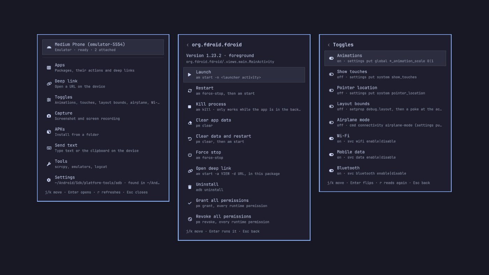

The Android developer's side of a device, on the [Omarchy](https://omarchy.org) bar: pick a device, pick a package, clear its data, force-stop it, fire a deep link, flip the developer toggles, take a screenshot, record the screen, install an APK, type into a field, start an emulator, mirror with scrcpy, follow logcat, pair a phone over Wi-Fi and lose the cable. No terminal, no Android Studio.

Started as a port of the Windows [ADB Extension for Command Palette](https://github.com/CostaFot/AdbExtension), the same way [Markets](https://github.com/CostaFot/omarchy-markets) was a port of the Markets extension, and grew into a device hub.

```bash
omarchy plugin add https://github.com/CostaFot/omarchy-android-dev --enable
```

Setting it up from a coding agent? Point it at `~/.config/omarchy/plugins/costafot.android-dev/AGENTS.md`: every setting, IPC verb and helper command, and `bin/omarchy-android-dev` answers in JSON.

## In the bar

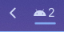


A droid glyph. Lit with a device, dimmed without one, red while the selected device waits for authorisation or is offline, red with a dot while a screen recording runs. With more than one device the count sits next to it; the tooltip names the selected device and its state.

* Left click opens the panel
* Middle click reads adb and the devices again

A notification says when a device connects, disconnects or needs authorising (accept the prompt on the phone). "Connects" means *became ready*: an emulator shows up offline for a while first and is announced once it has booted, by its AVD name.

## The panel

<p>
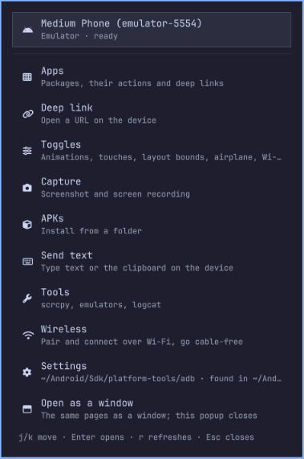
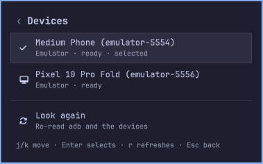
</p>

It opens on a hub: the selected device with its state, then the pages. Every page hangs off that device. `j`/`k` or the arrows move, Enter runs, `r` reads the page again, Escape or Backspace goes back a page and Escape on the hub closes. Pages with a box (a filter, a URL, a folder, a line of text) start typing at once; `/` puts the caret back in the box.

**Devices** is the picker: every device adb sees, with its kind (USB, emulator, Wi-Fi) and state, the selected one checked. Enter selects the one the other pages talk to. With one device there is nothing to pick and the plugin uses it.

<p>
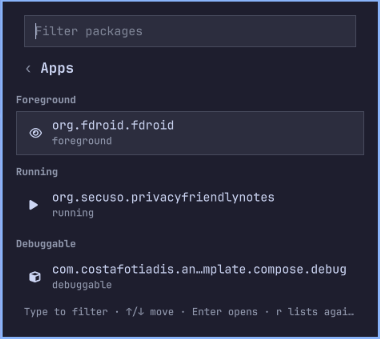
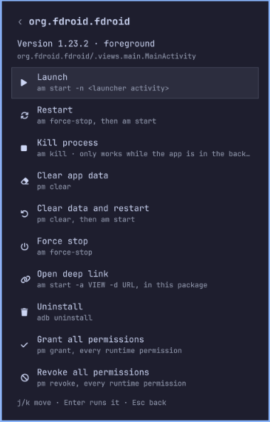
</p>

**Apps** lists the packages on the device, third-party by default (*Show system apps* lists them all), with a filter box. The one in the foreground comes first, then the running ones, then the debuggable ones, then the rest; the package you last opened sits on top when the box is empty. Enter opens a package: its version and launcher activity, then Launch, Restart, Kill process, Clear app data, Clear data and restart, Force stop, Open deep link, Uninstall (asks first), Grant all permissions, Revoke all permissions. Each row names the adb command it runs.

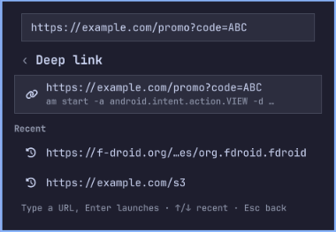

**Deep link** takes a URL or a custom scheme; Enter fires it (`am start -a android.intent.action.VIEW -d URL`). The last ten are listed under *Recent* and fire again with Enter. From a package's actions page the link is scoped to that package, so an ambiguous scheme lands in the right app.

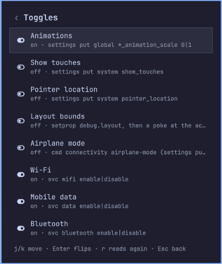

**Toggles** are Animations, Show touches, Pointer location, Layout bounds, Airplane mode, Wi-Fi, Mobile data, Bluetooth and Demo mode, each with its current state read from the device in one call. Enter flips one and every row repaints from the answer. Each row names the adb command behind it. Demo mode is Android's clean status bar for screenshots and recordings: the clock at 12:00, a full battery and full signal, no notification icons. Vendor skins honour it in part; an HONOR phone on Android 16 took the battery and the notification icons but kept its real clock and signal bars.

<p>
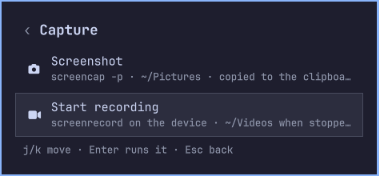
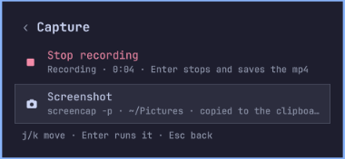
</p>

**Capture** has Screenshot (saved to your Pictures folder, put on the clipboard, shown in a notification) and Start recording. A recording runs on the device (`screenrecord`, three minutes at most) while the row counts the seconds and the bar glyph shows a dot; Enter again stops it, and the mp4 is pulled into your Videos folder, removed from the device and announced. The folders follow Omarchy's own (`OMARCHY_SCREENSHOT_DIR`, `OMARCHY_SCREENRECORD_DIR`, else `~/Pictures` and `~/Videos`) and can be set in the plugin settings.

<p>
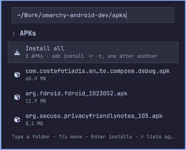

</p>

**APKs** is a folder box, prefilled from the *APK folder* setting (`~/Downloads`), listing the `.apk` files in it as you type. Enter on one installs it (`adb install -r -t`, so a debug build marked testOnly installs too) and the row says Installed or quotes adb's `Failure [...]`. *Install all* runs them one after another and sends one notification for the batch.

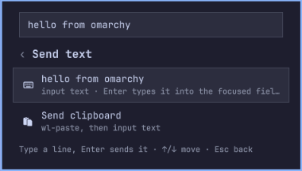

**Send text** types a line into whatever field has focus on the device, or sends the clipboard. Android's `input text` types one line of ASCII; anything else is refused with a plain message rather than typed wrong (a `%s` in the text becomes a space on the device, input's own escape).

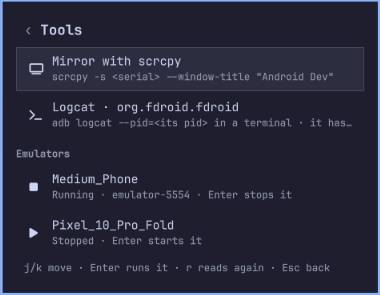

**Tools** has *Mirror with scrcpy* (once scrcpy is installed; with *Mirror with the screen off* on, the phone's own screen goes dark and stays awake while the mirror runs, and the *Extra scrcpy arguments* setting is appended; the row says whether it mirrors over USB or over Wi-Fi), *Logcat* for the package you last opened (`adb logcat --pid=…` in your default terminal; the app has to be running), and one row per emulator AVD showing Running or Stopped: Enter starts a stopped one and, after a confirm, stops a running one. What this page launches is yours to close; the plugin never kills it.

<p>
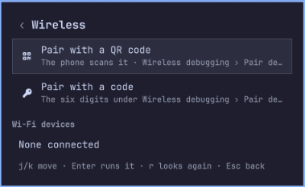
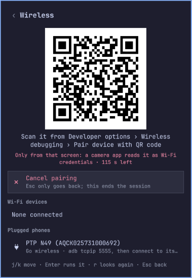
</p>

**Wireless** gets a phone onto Wi-Fi debugging, three ways. *Pair with a QR code* shows a code in the panel; on the phone open Developer options › Wireless debugging › *Pair device with QR code* and scan it from there, nowhere else: the code is a Wi-Fi-credential string by format, and a camera app would try to join a network that does not exist. The plugin waits up to two minutes, pairs, and adb connects by itself from then on whenever the phone's Wireless debugging is on (Android picks a new port each time it is toggled; adb finds it through mDNS, so there is nothing to type again). *Pair with a code* takes the address and the six digits from *Pair device with pairing code* (a different port from the one on the main Wireless debugging screen), in two steps in the one box. A paired phone that is on the network but not connected shows under *Seen on the network*; Enter connects to it. *Go wireless*, on a plugged phone, is the older way that needs no pairing: `adb tcpip 5555`, then a connect to the phone's Wi-Fi address; the cable can come out, and the phone appears twice in the picker until it does, the Wi-Fi entry selected. It lasts until the phone reboots; *Back to USB* ends it sooner and drops the Wi-Fi entry. Each Wi-Fi entry has Disconnect. A paired phone over Wi-Fi mirrors, records and takes every other page like a plugged one.

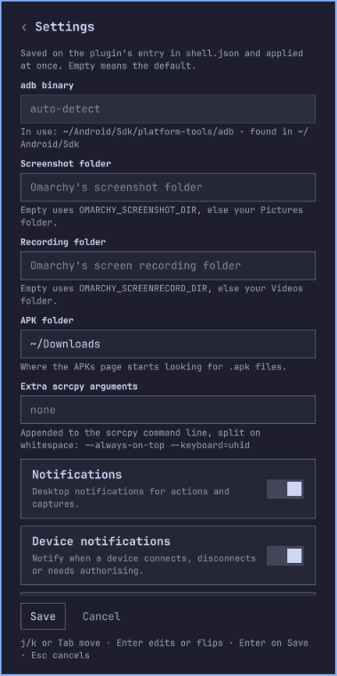

**Settings** is a form: the adb binary, the screenshot, recording and APK folders, the extra scrcpy arguments, and the five switches (mirror with the screen off, notifications, device notifications, confirm uninstall, show system apps). Tab, `j`/`k` and the arrows walk it, Enter edits a field or flips a switch, Save writes what changed to your `shell.json` and the plugin takes it at once, no restart. The hub's Settings row names the adb in use and how it was found.

Every action shows its result in the panel and sends a notification with the device's name.

## Settings

Saved on the plugin's entry in `~/.config/omarchy/shell.json`, from the panel's Settings page or with `omarchy bar set costafot.android-dev KEY VALUE` (`--json` for a boolean; the plain word works too). Either way the plugin picks them up at once.

| Key | Default | What it does |
|---|---|---|
| `adbPath` | empty | The adb binary, or the folder holding it. Empty looks in `$ANDROID_HOME` or `$ANDROID_SDK_ROOT`, then `~/Android/Sdk/platform-tools`, then `PATH`. A path that holds no adb is reported on the hub, not silently replaced. |
| `screenshotDir` | empty | Where screenshots go. Empty uses `OMARCHY_SCREENSHOT_DIR`, else your Pictures folder. |
| `recordingDir` | empty | Where screen recordings go. Empty uses `OMARCHY_SCREENRECORD_DIR`, else your Videos folder. |
| `apkDir` | `~/Downloads` | Where the APKs page starts looking. |
| `scrcpyArgs` | empty | Appended to the scrcpy command line, split on whitespace (`--always-on-top --keyboard=uhid`). |
| `mirrorScreenOff` | `false` | Mirror with the device's screen off: scrcpy gets `--turn-screen-off --stay-awake`, so the phone stays dark and, plugged in, awake while the mirror runs; the screen comes back when scrcpy closes. |
| `notify` | `true` | Desktop notifications for actions and captures. |
| `deviceNotifications` | `true` | A notification when a device connects, disconnects or needs authorising. |
| `confirmUninstall` | `true` | Ask before uninstalling an app. |
| `showSystemApps` | `false` | List every package on the Apps page, not only third-party ones. |

## Requirements

`adb`, from the `android-tools` package or the SDK platform-tools. It does not need to be on `PATH`: the plugin looks in `$ANDROID_HOME`, `$ANDROID_SDK_ROOT` and `~/Android/Sdk` too, and the `adbPath` setting can point at it.

A device over USB with USB debugging on, or an emulator, or a phone over Wi-Fi: Android 11 or newer with Wireless debugging on for the pairing paths (the QR one also wants the SDK's adb, which has mDNS built in where the `android-tools` one does not, and `qrencode`, which Omarchy ships), any Android with the cable in once for Go wireless. The phone and this machine have to be on the same network with nothing in between: a VPN that isolates the LAN (NordVPN with LAN Discovery off, say) leaves the plugin with timeouts. The Tools page needs the SDK's `emulator` for the AVD rows and the `scrcpy` package for mirroring; both are optional and the rows appear when they are installed, no restart needed.

## From the shell

```bash
omarchy-shell costafot.android-dev help          # the verbs
omarchy-shell costafot.android-dev toggle        # the hub
omarchy-shell costafot.android-dev status | jq   # adb, devices, the tracker, the settings in force
omarchy-shell costafot.android-dev screenshot    # saved, on the clipboard, with a notification
omarchy-shell costafot.android-dev select emulator-5554
omarchy-shell costafot.android-dev page packages # open the panel on a page: hub, devices, packages, deeplink, toggles, capture, apks, text, tools, wireless, settings
omarchy-shell costafot.android-dev launch com.android.chrome   # forcestop and clear take a package too
omarchy-shell costafot.android-dev deeplink https://example.com
omarchy-shell costafot.android-dev flip touches  # animations, touches, pointer, layout, airplane, wifi, data, bluetooth, demo
omarchy-shell costafot.android-dev record start  # stop pulls the mp4 into ~/Videos; toggle does either
omarchy-shell costafot.android-dev text "hello world"          # typed into the focused field; clipboard sends the clipboard
omarchy-shell costafot.android-dev scrcpy                      # mirror the selected device
omarchy-shell costafot.android-dev avd Medium_Phone            # start that emulator
omarchy-shell costafot.android-dev logcat com.android.chrome   # adb logcat --pid in a terminal; no package follows everything
omarchy-shell costafot.android-dev pair start                  # a pairing QR code in the panel; stop cancels it
omarchy-shell costafot.android-dev tcpip ""                    # go wireless with the selected (plugged) phone; usb "" puts it back, disconnect ADDR drops a Wi-Fi entry
```

Every verb returns at once; the result arrives as a notification and in the panel.

## Keybindings, the menu and window rules

Omarchy's bindings live in `~/.config/hypr/bindings.lua`. Two lines give the panel and a screenshot a key (`SUPER + ALT + A` and `SUPER + ALT + C` are free in the defaults; pick others if you use them):

```lua
o.bind("SUPER + ALT + A", "Android Dev panel", "omarchy-shell costafot.android-dev toggle")
o.bind("SUPER + ALT + C", "Android screenshot", "omarchy-shell costafot.android-dev screenshot")
```

The same two as classic Hyprland config lines, for a `bindings.conf`:

```
bindd = SUPER ALT, A, Android Dev panel, exec, omarchy-shell costafot.android-dev toggle
bindd = SUPER ALT, C, Android screenshot, exec, omarchy-shell costafot.android-dev screenshot
```

To put the panel on the Omarchy menu (`SUPER + SPACE`), add a row to `~/.config/omarchy/extensions/omarchy-menu.jsonc`; the second line puts a screenshot row under the Capture submenu:

```jsonc
"android": {"icon":"","label":"Android Dev","action":"omarchy-shell costafot.android-dev toggle","description":"Devices, apps, toggles, captures, APKs, emulators"},
"trigger.capture.android": {"icon":"","label":"Android screenshot","action":"omarchy-shell costafot.android-dev screenshot"},
```

The emulator and scrcpy open as tiled windows, which is rarely what a phone-shaped window wants: tiled, the emulator keeps the phone's proportions and pads the rest of the tile grey, with its toolbar floating loose over it. Two rules in `~/.config/hypr/hyprland.lua` (after the `require` lines) float them; the emulator's window class is `Emulator` and scrcpy is launched with the window title `Android Dev`:

```lua
o.window("^(Emulator)$", { float = true })
o.window({ class = "^(scrcpy)$", title = "^(Android Dev)$" }, { float = true, center = true })
```

Floated, the emulator takes its phone shape with the toolbar attached to its right edge, and it reopens where you last dragged it (it remembers its own position, so `center` would do nothing for it). scrcpy opens centred.

## From a terminal

Every command answers with one line of JSON. Errors ride inside it; the exit code is always 0.

```bash
bin/omarchy-android-dev status | jq '{adb, selected, tools}'
bin/omarchy-android-dev devices | jq '.devices[] | [.serial, .state, .label]'
bin/omarchy-android-dev packages | jq '.packages[] | [.name, .section, .detail]'
bin/omarchy-android-dev package com.android.chrome | jq '{launcher_activity, runtime_permissions}'
bin/omarchy-android-dev app launch com.android.chrome | jq .notice       # restart, force-stop, kill, clear, clear-restart, uninstall
bin/omarchy-android-dev perms grant com.android.chrome | jq .notice      # or revoke
bin/omarchy-android-dev deeplink https://example.com | jq .notice
bin/omarchy-android-dev toggles | jq '.toggles | map_values(.text)'
bin/omarchy-android-dev toggle touches | jq .notice                     # animations, touches, pointer, layout, airplane, wifi, data, bluetooth, demo
bin/omarchy-android-dev screenshot | jq .path                           # saved, on the clipboard, with a notification
bin/omarchy-android-dev record                                          # records until Ctrl-C, then prints the mp4's path
bin/omarchy-android-dev select emulator-5554 | jq .notice               # with more than one device attached; --serial S does it per call
bin/omarchy-android-dev apk list ~/Downloads | jq '.apks[].name'        # apk install PATH... installs them in turn
bin/omarchy-android-dev text send "hello world" | jq .notice            # text clipboard sends the clipboard
bin/omarchy-android-dev tools | jq '.avds[] | [.name, .detail]'         # tool scrcpy, tool avd NAME, tool avd-stop SERIAL, tool logcat [PKG]
bin/omarchy-android-dev wireless | jq '{mdns, services}'                # the pairing and connect services on the network
bin/omarchy-android-dev pair qr                                         # prints the PNG's path, waits for the phone to scan it; Ctrl-C cancels
printf '123456\n' | bin/omarchy-android-dev pair code 192.168.1.5:37123 # the code on stdin, never on the command line
bin/omarchy-android-dev connect 192.168.1.5 | jq .notice                # disconnect ADDR; tcpip [USBSERIAL] goes wireless, usb [SERIAL] comes back
```

Emulators show up by their AVD name, as in `Pixel 10 Pro Fold (emulator-5554)`.

## How it runs

The shell never runs `adb` itself. A Python 3 helper with no dependencies does, started as `/usr/bin/python3` with an argument list, never through a shell string; every adb call is an argument list too, with `-s SERIAL` on every device command, a deadline and a size cap on what it reads back, and a child that outruns either is stopped and reported, never parsed. One device tracker (`adb track-devices`) runs per shell and is restarted with backoff when adb goes away. The plugin never kills a process it did not start: scrcpy, the emulator and the logcat terminal are started detached, the way Omarchy's own launchers start apps, and are left alone; an emulator stops through `adb emu kill`. scrcpy is told to use the same `adb` as the plugin, so a second adb on `PATH` (the `scrcpy` package installs one) changes nothing.

State lives in `~/.local/state/omarchy/costafot.android-dev/`: the selected device, the last package per device, the recent deep links, a package cache, and, while a pairing code is up, its PNG (readable by you alone, removed when the session ends). The directory is private to your user and checked on every run; files are written atomically and read through descriptors that refuse symlinks. Settings live on the plugin's entry in your `shell.json` and nowhere else. A pairing code goes to `adb pair` on its stdin, never on a command line where `ps` would show it.

**Leaves your machine:** nothing beyond your own network. `adb` talks to its own server on `127.0.0.1:5037` and to your device, over USB or, for a Wi-Fi device, to the phone's address on your LAN; adb's mDNS discovery is multicast on that LAN. The plugin makes no network request of its own.

## FAQ

**adb is not on my PATH.** It does not have to be. The plugin looks in `$ANDROID_HOME` and `$ANDROID_SDK_ROOT`, then `~/Android/Sdk/platform-tools`, then `PATH`; the hub's Settings row says which one it found. Point `adbPath` at a binary or a folder to be explicit; if that path holds no adb the hub says so instead of quietly using another one.

**The hub says "needs authorising".** The phone is showing the *Allow USB debugging?* prompt; accept it, and tick *Always allow* to skip it next time. If no prompt appears, *Revoke USB debugging authorisations* in the developer options and replug. The glyph stays red and the device pages wait until the device is ready.

**Two devices, and it talks to the wrong one.** Enter on the hub's device row opens the picker. The choice is remembered per serial; when the remembered device is gone and one other is attached, that one is used. Over IPC and from a terminal, `select SERIAL` or `--serial SERIAL` does the same.

**Which wireless path do I use?** A phone that is plugged in right now: *Go wireless*, then unplug. A phone that is not: *Pair with a QR code* (or with a code when the QR row is missing, which means this adb has no mDNS) once; after that it connects on its own whenever its Wireless debugging is on. A phone paired before that did not come back by itself: toggle its Wireless debugging off and on, or pick it under *Seen on the network*; from a terminal, `bin/omarchy-android-dev connect ip:port` with what the Wireless debugging screen shows.

**It paired, but the phone shows offline or disappeared.** Android drops Wireless debugging when the phone leaves the network or sleeps for long, and picks a new port when it is toggled. Toggle it off and on, then *Look again* on the Devices page or `r` on the Wireless page; a paired phone reconnects by itself once its service is back on the network. The switch can read on while its server is not running (seen on an HONOR phone after a reboot): toggling it is the cure there too. Keep the phone awake while pairing; asleep, it filters the multicast that mDNS runs on and answers no query. If nothing on Wi-Fi ever works, check for a VPN on either side that isolates the LAN: with NordVPN's LAN Discovery off, for example, even a ping to the phone gets nothing back.

**Send text refuses my text.** Android's `input text` takes one line of printable ASCII, so accents, emoji and line breaks are refused rather than typed wrong. Apps such as ADBKeyboard accept UTF-8 through a broadcast; that needs an APK on the device and is not built in.

**Typing and taps do nothing on my phone.** Some vendor ROMs block input injection over adb until *USB debugging (Security settings)* is enabled in the developer options. For scrcpy the usual answer is `--keyboard=uhid --mouse=uhid`, which go in the *Extra scrcpy arguments* setting.

**The emulator window looks wrong.** The emulator is an X11 program under XWayland (its bundled Qt has no Wayland plugin), and its toolbar is a second window: the two only line up when the main window floats, which the rule above does. On a scaled monitor it renders at 1x and comes out small; it ignores `QT_SCALE_FACTOR`, so resize the window and the screen scales with it.

**A recording was running when the shell restarted.** The device finishes the file on its own; it stays at `/sdcard/omarchy-android-dev-<stamp>.mp4` and the plugin does not pull leftovers. `adb pull` it and remove it by hand.

**What is different from the Windows extension?** Global per-action favourites are replaced by the last package per device and the recent deep links. The panel stays open after an action. Installs pass `-t` so debug builds install. A package with only a service process counts as Running. Uninstall asks first, and can be told not to.

## Update and uninstall

```bash
omarchy plugin update costafot.android-dev
```

```bash
omarchy plugin remove costafot.android-dev
rm -rf ~/.local/state/omarchy/costafot.android-dev
```

Ideas for later, and what was left out on purpose, are in `IDEAS.md`.
